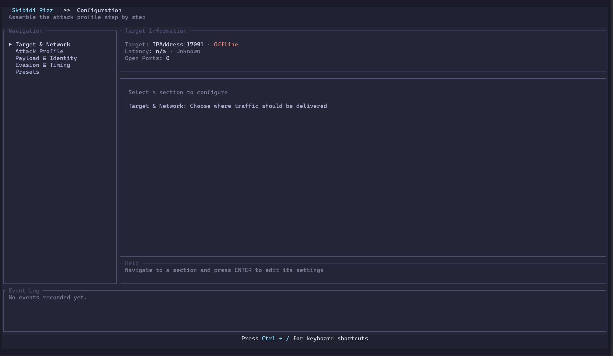
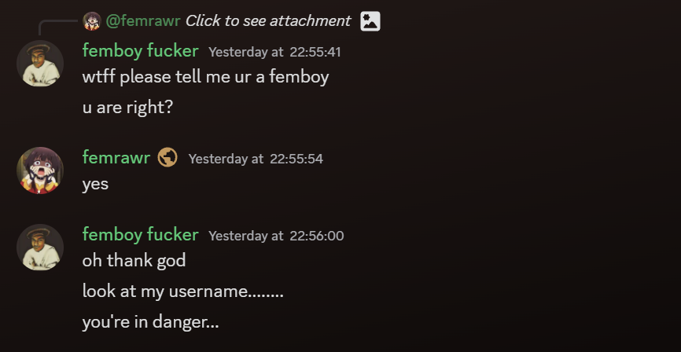
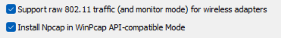

<h1 align="center">Skibidi Rizz</h1>

<p align="center">
  
  <br>
  
  
  
  <br>
  <em>A stupid ddos tool with TUI interface</em>
  <br>
  <em>Also a plugin that use for my RAT Project (Kurinium)</em>
</p>

<h1 align="center">My Discord Server~!</h1>
<p align="center">
  
  <br>
  <em>Plz join, Everyone are friendly!!!!!</em>
  <br>
  <a href="https://discord.gg/tF64959UXv">Join here!</a>
</p>

## About

**Skibidi Rizz** is a stupid Rust based ddos tool. Built with a TUI using Ratatui, Because i love it.

## Features

- **TUI** - Tokyo Night themed, Archinstall inspired design
- **Performance** - Async I/O w Tokio, multi threaded architecture
- **Discord RPC** - Now you can disable it

### Attack Modes

1. **UDP** - Basic UDP packet flooding
2. **TCP** - TCP SYN flood (requires raw sockets)
3. **HTTP** - HTTP GET request flood
4. **DNS Flood** - DNS query flooding
5. **Amplification** - DNS amplification attack
6. **Slowloris** - Slow HTTP header attack
7. **Fragmentation** - IP packet fragmentation
8. **Burst** - High-intensity packet bursts
9. **TCP Connect** - Full TCP connection flood
10. **PortScan** - Port scanning with service detection

## UI Navigation

- **Cheat sheet** - Press **Ctrl + /**

<p align="left">
  
</p>

## Installation

### Prerequisites

- **Rust** (latest stable version)
- **Windows Users**: Npcap for raw socket support (optional but recommended)

### Installing Npcap (Windows)


1. Download Npcap from [https://npcap.com/](https://npcap.com/)
2. Install with "WinPcap API-compatible Mode" enabled

<p align="left">
  
</p>

3. Download Npcap SDK from [https://npcap.com/#download](https://npcap.com/#download)
4. Extract to `C:\npcap-sdk-1.15\`

## Building

### Normal Build (Recommended)

```bash
git clone https://github.com/Mikasuru/skibidi-rizz.git
cd skibidi-rizz
cargo build --release
```

### Build with Raw Socket Support (Windows)

```bash
set LIB=C:\npcap-sdk-1.15\Lib\x64;%LIB%
cargo build --release --features pnet_datalink
```

### Build from Source (Linux/macOS)

```bash
git clone https://github.com/Mikasuru/skibidi-rizz
cd skibidi-rizz
cargo build --release
```

## Usage

### TUI Mode
```bash
# Launch with terminal interface
cargo run --release

# Or with specific target pre-filled
cargo run --release -- --target 192.168.1.1
```

### Examples

```bash
# basoc --
cargo run --release -- --target <ipaddr> --mode http --duration 300
# or --
# Show help
cargo run --release -- --help
```

---

<p align="center">
  Made with ❤️
  <br>
  <em>Skibidi Rizz</em>
</p>
